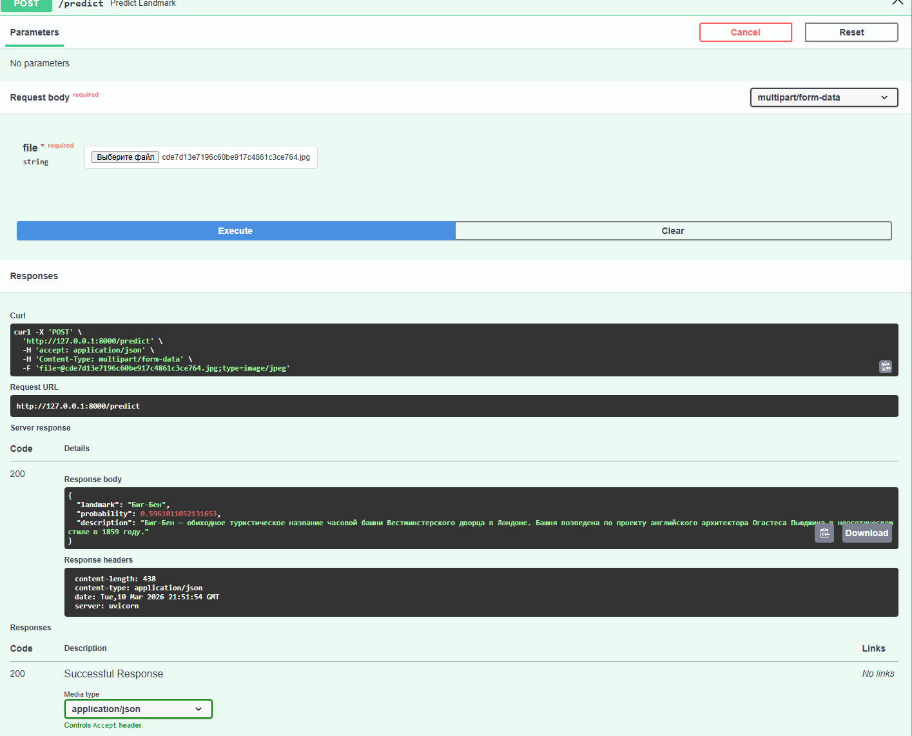

# landmark-telegram-bot
# 1. Landmark Recognition Bot
CV сервис, распознающий мировые достопримечательности на изображениях.

Система включает в себя:
- Модель классификации изображений: PyTorch
- API для вывода данных: FastAPI
- Интерфейс Telegram-бота: aiogram

Пользователи могут отправить фотографию боту и получить:
- предсказанную достопримечательность
- вероятность предсказания
- краткое описание


---
## 2. Архитектура проекта

Пользователь

  ↓

Telegram Bot (aiogram)

  ↓ HTTP

FastAPI API

  ↓

PyTorch модель

  ↓
  
Предсказание

## 3. Структура проекта

Проект организован в следующей структуре:

src/ — основной исходный код проекта

api/ — API сервис на FastAPI для получения предсказаний модели

main.py — запуск API и обработка запросов

bot/ — логика Telegram-бота

bot_main.py — точка входа бота

handlers.py — обработчики сообщений и команд

keyboards.py — Telegram-клавиатуры

config.py — конфигурация бота

inference/ — модуль инференса модели

predict.py — получение предсказания модели

preprocess.py — предобработка изображений

model/ — работа с ML-моделью

model.py — архитектура модели

load_model.py — загрузка обученных весов

data/ — датасет изображений и JSON-файлы с информацией о достопримечательностях

weights/ — сохранённые веса обученных моделей

notebooks/ — Jupyter-ноутбуки с анализом данных (EDA) и обучением моделей

metrics/ — метрики качества моделей и графики обучения

requirements.txt — список зависимостей проекта
---

## 4. Данные
Небольшой самописный датасет для классификации достопримечательностей, используемый в проекте landmark-telegram-bot. Содержит 10 классов с 50 изображениями на класс.
### Структура
data/dataset/

├─ eiffel_tower/

├─ colosseum/

├─ big_ben/

└─ ... 

Каждая папка — один класс (название достопримечательности). Изображения имеют формат JPG и размер ~224x224 px.

### Источники
- Wikimedia Commons
- Unsplash (CC0)
- Лицензия: свободное использование для образовательных целей

### Использование
Пример загрузки датасета в Python:

```python
from torchvision.datasets import ImageFolder
from torchvision import transforms

transform = transforms.Compose([
    transforms.Resize((224, 224)),
    transforms.ToTensor()
])

dataset = ImageFolder("data/dataset", transform=transform)
```

## 5. Модели
### 5.1. Baseline Model
**BaselineCNN (Видоизмененный VGG)**

**Описание модели:**  
- VGG-подобная сеть с 3 сверточными блоками и одним fully connected слоем.  
- Conv блоки: 64 → 128 → 256 фильтров, каждый блок содержит 2 Conv + BatchNorm + ReLU + MaxPool.  
- AdaptiveAvgPool2d используется перед fc слоем, чтобы уменьшить размерность до 256.  
- Fully connected слой: 256 → 512 → num_classes, с Dropout 0.5.  
- Использовалась аугментация: горизонтальное отражение, случайная яркость, контраст, поворот и масштабирование.  

**Количество параметров:**  ~1.3 млн (для fc1=512)  

**Hyperparameters:**  
- Optimizer: Adam, lr=1e-4  
- Loss: CrossEntropyLoss  
- Batch size: 16  
- Epochs: 20

**Результаты на валидации:**  


- Train Loss: `[2.3,2.2,2.1,2.1,2.1,2.0,2.0,2.0,2.0,2.0,2.0,1.9,1.9,1.9,1.9,1.9,1.8,1.9,1.9,1.7]`  
- Validation Loss: `[2.3,2.1,2.1,2.1,2.0,2.0,2.0,2.0,2.0,1.9,1.9,1.9,1.8,1.9,1.9,1.8,1.8,1.8,1.8,1.7]`  
- Validation Accuracy: `[0.1,0.26,0.29,0.24,0.29,0.27,0.26,0.32,0.3,0.36,0.28,0.35,0.36,0.33,0.32,0.33,0.36,0.39,0.43,0.39]`  
- Validation F1-score (macro): `[0.03,0.18,0.23,0.20,0.22,0.20,0.20,0.26,0.24,0.29,0.25,0.29,0.31,0.26,0.29,0.32,0.32,0.36,0.42,0.34]`  

**Комментарии:**  
- Эта baseline модель используется как отправная точка для сравнения с Transfer Learning моделью (MobileNetV2).  
- Метрики сохранены в `metrics/baseline_metrics.json`.  
- Модель сохранена в `weights/baseline_model.pth`.  
- Графики обучения: `metrics/artifacts/Baseline-loss_curve.png`, `metrics/artifacts/Baseline-accuracy_curve.png`.

### 5.2. MobileNetV2 (Transfer Learning)
**MobileNetV2 (с замороженными слоями и обученным классификатором)**

**Описание модели:**  
- Использована предобученная на ImageNet модель MobileNetV2.
- Заморожены все слои извлечения признаков, обучается только классификатор (classifier) для 10 классов. 
- Используются те же аугментации, что и для baseline модели: горизонтальное отражение, случайная яркость, контраст, поворот и масштабирование.
- Обучение на GPU (30 эпох) с Adam и lr=1e-4, CrossEntropyLoss.  

**Количество обучаемых параметров:**  ~12800

**Hyperparameters:**  
- Optimizer: Adam, lr=1e-4  
- Loss: CrossEntropyLoss  
- Batch size: 16  
- Epochs: 30

**Результаты на валидации:**  


- Train Loss: '[2.3,2.2,2.2,2.1,2.1,2.0,1.9,1.9,1.8,1.8,1.8,1.8,1.6,1.6,1.6,1.6,1.5,1.5,1.4,1.4,1.4,1.4,1.3,1.3,1.3,1.3,1.3,1.2,1.2]`  
- Validation Loss: `[2.2,2.2,2.1,2.1,2.0,1.9,1.9,1.8,1.8,1.81.7,1.7,1.6,1.6,1.6,1.5,1.5,1.5,1.4,1.4,1.4,1.3,1.3,1.3,1.3,1.2,1.2,1.2,1.2,1.1]`
- Validation Accuracy: `[0.18,0.33,0.46,0.57,0.70,0.67,0.79,0.84,0.84,0.81,0.86,0.83,0.83,0.86,0.87,0.84,0.84,0.85,0.86,0.86,0.86,0.85,0.87,0.87,0.86,0.88,0.87,0.87,0.87,0.89]`  
- Validation F1-score (macro): `[0.18,0.32,0.44,0.57,0.70,0.66,0.79,0.83,0.84,0.80,0.86,0.83,0.82,0.86,0.87,0.84,0.84,0.85,0.86,0.86,0.86,0.85,0.87,0.87,0.86,0.88,0.87,0.87,0.87,0.89]`  

**Комментарии:**  
- Модель показывает значительное улучшение качества по сравнению с baseline CNN (accuracy ↑ ~50%, F1 ↑ ~0.5).
- Метрики сохранены в `metrics/mobilenet_metrics.json`.  
- Модель сохранена в `weights/mobilenet_model.pth`.  
- Графики обучения: `metrics/artifacts/MobilenetV2-loss_curve.png`, `metrics/artifacts/MobilenetV2-accuracy_curve.png`.

## 6. FastAPI 
### Post 
/predict
### Запрос
multipart/form-data

file=image.jpg
### Ответ
{
 "landmark": "Eiffel Tower",
 "probability": 0.92,
 "description": "описание"
}
## 7. Telegram bot

### Описание интерфейса

Пользователь → присылает фото

Бот → Возвращает предсказание
### Пример ответа
📍 **Результат распознавания**

🏛 Место: Биг-Бен
📊 Вероятность: 56.59%

📝 Описание:
Биг-Бен — обиходное туристическое название часовой башни Вестминстерского дворца в Лондоне. Башня возведена по проекту английского архитектора Огастеса Пьюджина в неоготическом стиле в 1859 году.

## 8. Демо
### Telegram Bot демо

### FastAPI docs



## 9. Требования и установка
### Требования

- Python `== 3.11`


### Установка

```bash
# Перейти в папку проекта
cd landmark-telegram-bot

# Создать виртуальное окружение
python -m venv .venv

# Активировать окружение:
# Windows:
.venv\Scripts\activate
# Linux / macOS:
source .venv/bin/activate

# Установить зависимости
pip install --upgrade pip
pip install -r requirements.txt
```
В src/bot/config.py нужно заменить BOT_TOKEN на токен своего бота

## 10. Запуск проекта
Запустить API
```bash
uvicorn src.api.main:app --reload
```
Запустить бота
```bash
python -m src.bot.bot_main
```
## 11. Технический стек
- Python
- PyTorch
- FastAPI
- Aiogram
- OpenCV
- Torchvision

## 12. Автор
Ветошников Глеб

Email: gtvpresents@gmail.com


---