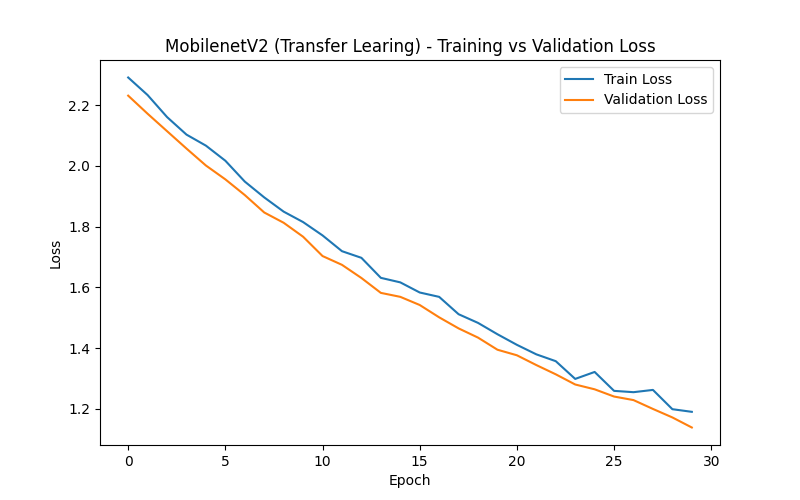
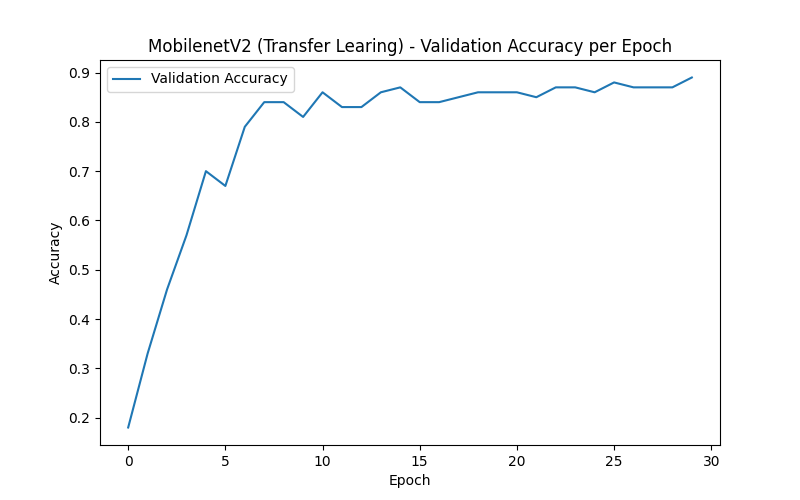

# landmark-telegram-bot
Production-style Computer Vision Telegram bot that recognizes world landmarks and returns structured descriptions. Built with PyTorch, EfficientNet and aiogram.

## 1. Паспорт проекта

- **Название проекта:** `Landmark Classification Bot`
- **Автор:** `Ветошников Глеб`
- **Контакт:** `gtvpresents@gmail.com`
---

## 2. Структура проекта

Проект организован в следующей структуре:

- `requirements.txt` – зависимости проекта (библиотеки Python, необходимые для запуска).
- `model/` – модели
- `bot/` – Telegram bot: принимает фото, вызывает инференс и возвращает результат
- `data/` – Датасет с изображениями, json файлы с названием и описанием достопримечательностей
- `weights/` – Сохраненные веса модели
- `tests/` – тесты (юнит-тесты, простые проверки).
- `notebooks/` – экспериментальные ноутбуки:
  - EDA, предобработка, обучение модели
- `utils/` – вспомогательные функции для работы с изображениями
---

## 3. Данные
Небольшой самописный датасет для классификации достопримечательностей, используемый в проекте landmark-telegram-bot. Содержит 30 классов с 50 изображениями на класс.
### Структура
data/dataset/

├─ eiffel_tower/

├─ colosseum/

├─ big_ben/

└─ ... (всего 30 папок)

Каждая папка — один класс (название достопримечательности). Изображения имеют формат JPG и размер ~224x224 px.

### Источники
- Wikimedia Commons
- Unsplash (CC0)
- Лицензия: свободное использование для образовательных целей

### Использование
Пример загрузки датасета в Python:

```python
from torchvision.datasets import ImageFolder
from torchvision import transforms

transform = transforms.Compose([
    transforms.Resize((224, 224)),
    transforms.ToTensor()
])

dataset = ImageFolder("data/dataset", transform=transform)
```

## 4. Модели
### 4.1. Baseline Model
**BaselineCNN (Видоизмененный VGG)**

**Описание модели:**  
- VGG-подобная сеть с 3 сверточными блоками и одним fully connected слоем.  
- Conv блоки: 64 → 128 → 256 фильтров, каждый блок содержит 2 Conv + BatchNorm + ReLU + MaxPool.  
- AdaptiveAvgPool2d используется перед fc слоем, чтобы уменьшить размерность до 256.  
- Fully connected слой: 256 → 512 → num_classes, с Dropout 0.5.  
- Использовалась аугментация: горизонтальное отражение, случайная яркость, контраст, поворот и масштабирование.  

**Количество параметров:**  ~1.3 млн (для fc1=512)  

**Hyperparameters:**  
- Optimizer: Adam, lr=1e-4  
- Loss: CrossEntropyLoss  
- Batch size: 16  
- Epochs: 20

**Результаты на валидации:**  


- Train Loss: `[2.3,2.2,2.1,2.1,2.1,2.0,2.0,2.0,2.0,2.0,2.0,1.9,1.9,1.9,1.9,1.9,1.8,1.9,1.9,1.7]`  
- Validation Loss: `[2.3,2.1,2.1,2.1,2.0,2.0,2.0,2.0,2.0,1.9,1.9,1.9,1.8,1.9,1.9,1.8,1.8,1.8,1.8,1.7]`  
- Validation Accuracy: `[0.1,0.26,0.29,0.24,0.29,0.27,0.26,0.32,0.3,0.36,0.28,0.35,0.36,0.33,0.32,0.33,0.36,0.39,0.43,0.39]`  
- Validation F1-score (macro): `[0.03,0.18,0.23,0.20,0.22,0.20,0.20,0.26,0.24,0.29,0.25,0.29,0.31,0.26,0.29,0.32,0.32,0.36,0.42,0.34]`  

**Комментарии:**  
- Эта baseline модель используется как отправная точка для сравнения с Transfer Learning моделью (MobileNetV2).  
- Метрики сохранены в `metrics/baseline_metrics.json`.  
- Модель сохранена в `weights/baseline_model.pth`.  
- Графики обучения: `metrics/artifacts/Baseline-loss_curve.png`, `metrics/artifacts/Baseline-accuracy_curve.png`.

### 4.2. MobileNetV2 (Transfer Learning)
**MobileNetV2 (с замороженными слоями и обученным классификатором)**

**Описание модели:**  
- Использована предобученная на ImageNet модель MobileNetV2.
- Заморожены все слои извлечения признаков, обучается только классификатор (classifier) для 10 классов. 
- Используются те же аугментации, что и для baseline модели: горизонтальное отражение, случайная яркость, контраст, поворот и масштабирование.
- Обучение на GPU (30 эпох) с Adam и lr=1e-4, CrossEntropyLoss.  

**Количество обучаемых параметров:**  ~12800

**Hyperparameters:**  
- Optimizer: Adam, lr=1e-4  
- Loss: CrossEntropyLoss  
- Batch size: 16  
- Epochs: 30

**Результаты на валидации:**  


- Train Loss: '[2.3,2.2,2.2,2.1,2.1,2.0,1.9,1.9,1.8,1.8,1.8,1.8,1.6,1.6,1.6,1.6,1.5,1.5,1.4,1.4,1.4,1.4,1.3,1.3,1.3,1.3,1.3,1.2,1.2]`  
- Validation Loss: `[2.2,2.2,2.1,2.1,2.0,1.9,1.9,1.8,1.8,1.81.7,1.7,1.6,1.6,1.6,1.5,1.5,1.5,1.4,1.4,1.4,1.3,1.3,1.3,1.3,1.2,1.2,1.2,1.2,1.1]`
- Validation Accuracy: `[0.18,0.33,0.46,0.57,0.70,0.67,0.79,0.84,0.84,0.81,0.86,0.83,0.83,0.86,0.87,0.84,0.84,0.85,0.86,0.86,0.86,0.85,0.87,0.87,0.86,0.88,0.87,0.87,0.87,0.89]`  
- Validation F1-score (macro): `[0.18,0.32,0.44,0.57,0.70,0.66,0.79,0.83,0.84,0.80,0.86,0.83,0.82,0.86,0.87,0.84,0.84,0.85,0.86,0.86,0.86,0.85,0.87,0.87,0.86,0.88,0.87,0.87,0.87,0.89]`  

**Комментарии:**  
- Модель показывает значительное улучшение качества по сравнению с baseline CNN (accuracy ↑ ~50%, F1 ↑ ~0.5).
- Метрики сохранены в `metrics/mobilenet_metrics.json`.  
- Модель сохранена в `weights/mobilenet_model.pth`.  
- Графики обучения: `metrics/artifacts/MobilenetV2-loss_curve.png`, `metrics/artifacts/MobilenetV2-accuracy_curve.png`.


## 6. Требования и установка

- Python `== 3.11`

## 7. Как запустить проект

```bash
# Перейти в папку проекта
cd landmark-telegram-bot

# Создать виртуальное окружение
python -m venv .venv

# Активировать окружение:
# Windows:
.venv\Scripts\activate
# Linux / macOS:
source .venv/bin/activate

# Установить зависимости
pip install --upgrade pip
pip install -r requirements.txt
```
---